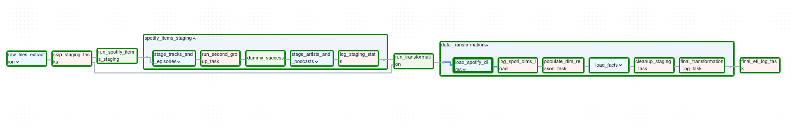
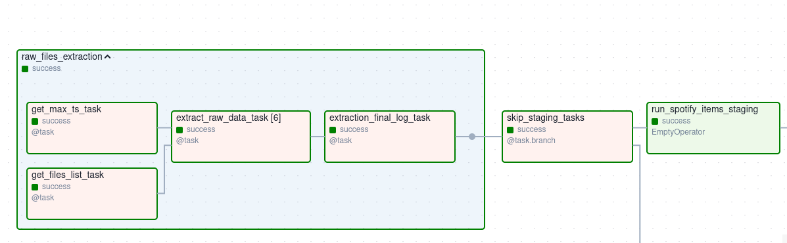
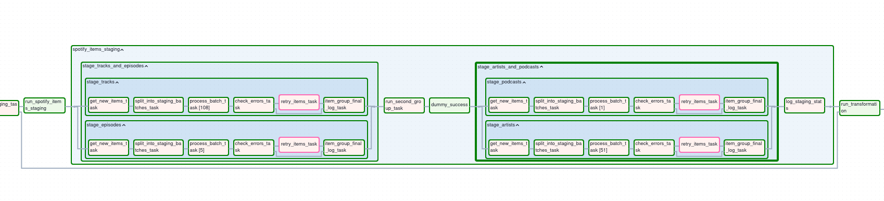
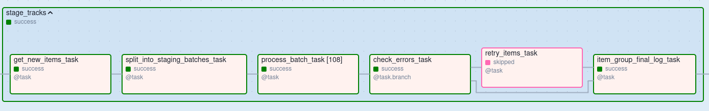
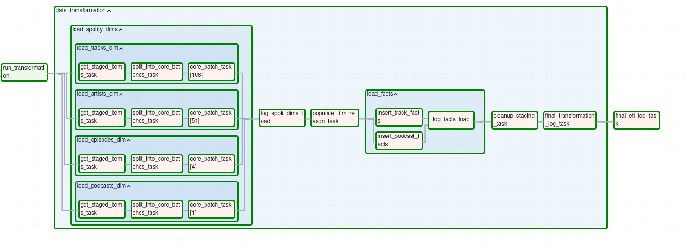

# Spotify ETL Pipeline with Apache Airflow
This project is an Airflow implementation of my [Spotify Data Warehouse project](https://github.com/averelli/Spotify-Streaming-ETL-Pipeline) which was written with just Python. The original repo explains the data model and Postgres schema design. This repo focuses on how the ETL is scheduled, monitored, and run in Airflow.

--- 

## Features Overview

This repo focuses purely on Airflow orchestration:
- **Raw files extraction** – Reads raw Spotify JSON history files and stages them into PostgreSQL
- **Staging pipeline** – Calls Spotify APIs for metadata enrichment (tracks, artists, episodes, podcasts) and loads results into staging tables
- **Transformation pipeline** – Cleans staged data, populates dimension tables, and inserts new facts into core fact tables
- **Logging tasks** – Final logging tasks summarize extraction, staging, and transformation steps for monitoring

The project showcases:
- Dynamic Task Mapping (.expand) for batch processing
- Branching (@task.branch) for conditional retries
- Modular task groups for each Spotify entity
- Separation of logic functions from Airflow-specific wrappers (testable Python code)

---

## Project Overview

The pipeline consists of the following main steps:
### Data Extraction

- First we get the last inserted timestamp from the core layer (or staging if some data is already there)
- Then we read the JSON files from `raw_data/` and filter rows based on that timestamp
- If there are new rows, we stage them and log the result
- Lastly, there is a check if any new data was staged, if not, we skip the next task group and go straight to transformation (since there still could be old unprocessed data in staging due to a crash)

### Staging Spotify Items

From the staged data, select new Spotify items (tracks, artists, podcasts and podcast episodes) and call Spotify API to get data about them. In the raw data we only get Spotify URIs for tracks and episodes, so to get URIs for artists and podcasts we need to stage them first. Hence two main sub groups: `stage_tracks_and_episodes` and `stage_artists_and_podcasts`. They are separated by an empty operator that will always allow the second group to run even if the first group was skipped due to no new tracks or episodes, unless we are skipping this whole step.

Each item has an identical task group:

- First we select the new Spotify URIs to process
- Then we split that list into batches (Spotify API accepts max of 50 items for one call)
- Then we are using dynamic task mapping for bath processing. Each task gets its own batch of Spotify URIs, calls the API, stages the data. If something goes wrong, the task will retry (in case of a rate limit error) or skip this batch and the items will be retried later individually
- After all the batches are done, we check if any of them were marked as failed (returned more than zero failed URIs)
- If true, we retry them individually, and if any fail individually we log them into a separate table (see `etl_internal` schema in the main project)
- If all the bathes were successful, or after retrying the failed URIs we log the result

### Cleaning and Loading

This stage starts with an empty task that can be activated by skipping the staging task group.

- First we have the `load_spotify_dims` task group which consists of four sub groups, one for each item type. 
- Each sub group runs as follows: get the staged item ids -> split them into batches (each batch is going to be inserted inside a transaction so if a crash happens, we only have to redo the last batch) -> dynamically map the processing task to each batch, inside the task we clean the data and insert it into the core layer 
- After all the groups are done we log the result
- Then we populate `dim_reason` with any new reasons 
- After that we insert data into the fact tables, one task for music history and one for podcast
- Log the facts insert
- Clean up staging layer
- Log the overall result
- And finally, log the result of the whole ETL process

---

## Project Structure
```
.
├── dags/                               
│   └── main_dag.py                     # Main ETL DAG
├── docs/                               
├── logs/                               # Airflow logs
├── plugins/    
│   └── hooks/
│       ├── db_postgres_hook.py         # Postgres hook with added functionality
│       └── spotify_api_hook.py         # Custom hook for the Spotify client
├── scripts/                            
│   ├── data_extraction/
│   │   ├── raw_data_extractor.py       # Handles inserting raw data from JSON files
│   │   └── spotify_items_staging.py    # Handles the API calls logic for staged data
│   ├── data_transformation/
│   │   ├── cleaning_utils.py           # Helper functions to clean the API response
│   │   └── transformer.py              # Handles logic for data transformation and loading
│   └── utils.py                        # Shared helper logic
├── docker-compose.yaml                 # Airflow + Postgres services
├── .env                                # Environment variables 
├── .env.example                        # Example of the .evn file
└── README.md                           
```

---

## Setup Instructions

1. **Clone the repository**
2. **Environment variables**
Create a `.env` file with settings provided in the `.env.example`
3. **Start Airflow**
Run with Docker Compose. This will start:
    - Airflow Webserver (UI available at http://localhost:8080)
    - Airflow Scheduler
    - Metadata Postgres (Airflow backend)
    - DWH Postgres 
4. **Extra dependencies**
This project requires spotipy for Spotify API calls. It is installed automatically at container startup via:
`_PIP_ADDITIONAL_REQUIREMENTS: "spotipy"`